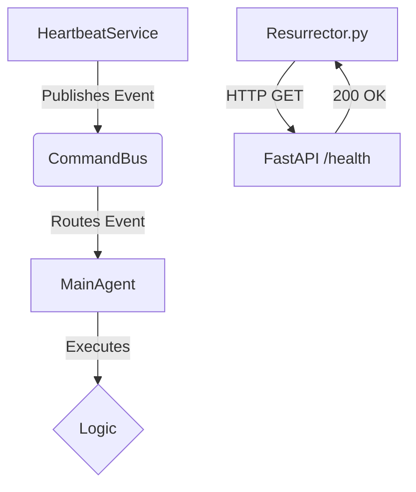

# Heartbeat & Resurrection System Plan

## Objective
Implement a fully decoupled, event-driven "Pulse" system.
1.  **Internal Pulse:** A background service that wakes the agent up every 30 minutes (configurable) to perform self-maintenance or checks.
2.  **External Watchdog:** A robust process monitor that ensures the application is responsive via HTTP, not just existing.

## Architecture: Event-Driven Decoupling

The system relies on the `CommandBus` to decouple the *Trigger* (Heartbeat) from the *Action* (Agent).

## Components

### 1. Heartbeat Service (The Trigger)
*   **File:** `src/services/heartbeat_service.py` (New)
*   **Responsibility:**
    *   Runs in the background (asyncio task).
    *   Reads `HEARTBEAT_INTERVAL` from env (Default: 1800s / 30m).
    *   Publishes `Event(type=EventType.HEARTBEAT, payload={"instruction": "Perform system health check"})`.
*   **Decoupling:** It does not know *who* receives the event. It just pulses.

### 2. Domain Events
*   **File:** `src/domain/event.py`
*   **Action:** Ensure `EventType.HEARTBEAT` exists.
*   **Payload:** Standardized payload allowing "predefined work" instructions.

### 3. Main Agent (The Processor)
*   **File:** `src/agents/main_agent.py`
*   **Action:**
    *   Subscribe to `EventType.HEARTBEAT`.
    *   **Handler:** `_handle_heartbeat(event)`.
    *   **Logic:**
        *   Treats the payload instruction as a prompt.
        *   Executes reasoning/tools if necessary.
        *   **Crucial:** Does *not* attempt to send a Telegram reply. Logs output to `valh.log` or updates internal state.

### 4. Health Endpoint (The Proof of Life)
*   **File:** `src/server.py`
*   **Action:** Add `GET /health`.
*   **Response:** `{"status": "ok", "uptime": ..., "last_heartbeat": ...}`.

### 5. Smart Resurrector (The Watchdog)
*   **File:** `resurrector.py`
*   **Action:**
    *   Loop every 30s.
    *   Check PID.
    *   Check `http://localhost:8000/health`.
    *   **Failure Logic:** 3 consecutive HTTP failures -> Kill PID -> Restart.

## Implementation Steps

1.  **Domain & Config:**
    *   Verify `EventType.HEARTBEAT`.
    *   Add `HEARTBEAT_INTERVAL` to `config` or `os.getenv`.

2.  **Server Upgrade:**
    *   Implement `GET /health` in `src/server.py`.

3.  **Service Creation:**
    *   Create `src/services/heartbeat_service.py`.
    *   Integrate into `main.py` (ApplicationManager).

4.  **Agent Logic:**
    *   Add `_handle_heartbeat` to `MainAgent`.

5.  **Watchdog Upgrade:**
    *   Rewrite `resurrector.py` to use `urllib` (std lib) for health checks.

## Rollback Strategy
*   Backup `resurrector.py` to `resurrector.py.bak`.
*   If the Heartbeat Service causes event loops to hang, disable it via env var `ENABLE_HEARTBEAT=false`.
